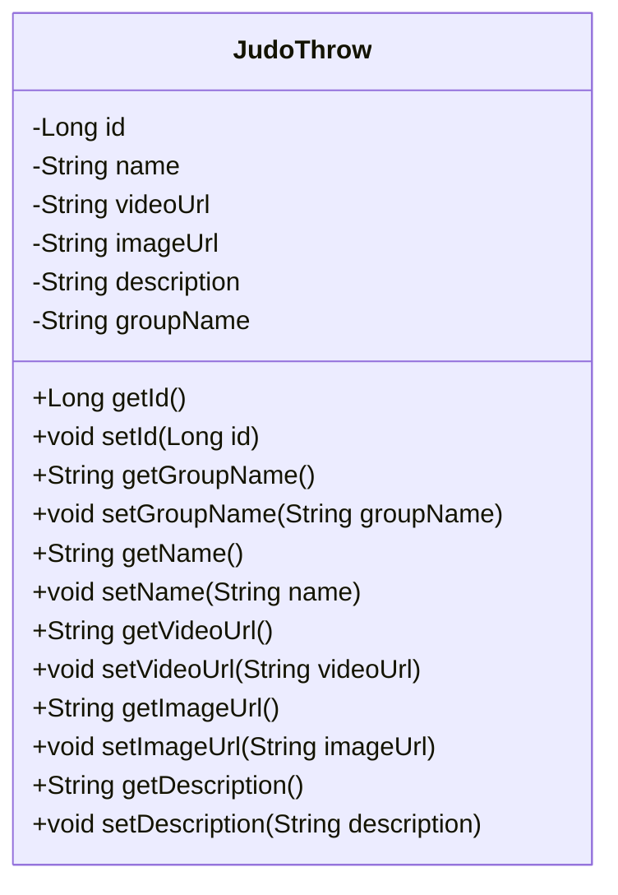

# judo-techniques
Projeto para demonstração de grupo de golpes de Judô padronizados pelo Go Kyo No Waza

## Diagrama de classes

```mermaid
classDiagram
    class JudoThrow {
        -Long id
        -String name
        -String videoUrl
        -String imageUrl
        -String description
        -String groupName
        +Long getId()
        +void setId(Long id)
        +String getGroupName()
        +void setGroupName(String groupName)
        +String getName()
        +void setName(String name)
        +String getVideoUrl()
        +void setVideoUrl(String videoUrl)
        +String getImageUrl()
        +void setImageUrl(String imageUrl)
        +String getDescription()
        +void setDescription(String description)
    }

```
