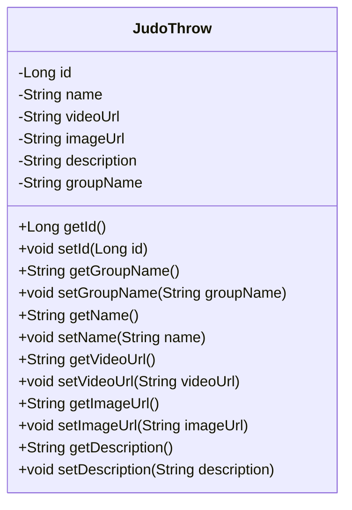

# Judo Techniques API

API simples para gerenciar técnicas de judô.

## Diagrama de classes

## API Endpoints

## Endpoints da API

### 1. Listar Todas as Técnicas de Judo

- **Method**: `GET`
- **URL**: `/judothrows`
- **Response**: Lista de técnicas de judô.

### 2. Buscar uma Técnica de Judo por ID

- **Method**: `GET`
- **URL**: `/judothrows/{id}`
- **Parameters**: `id` (ID da técnica)
- **Response**: Detalhes da técnica de judô especificada pelo ID.

### 3. Adicionar uma Nova Técnica de Judo

- **Method**: `POST`
- **URL**: `/judothrows`
- **Request Body**: Dados da técnica em formato JSON.
- **Response**: Dados da técnica adicionada, incluindo seu ID.

### 4. Atualizar uma Técnica de Judo

- **Method**: `PUT`
- **URL**: `/judothrows/{id}`
- **Parameters**: `id` (ID da técnica)
- **Request Body**: Dados atualizados da técnica em formato JSON.
- **Response**: Dados atualizados da técnica.

### 5. Deletar uma Técnica de Judo

- **Method**: `DELETE`
- **URL**: `/judothrows/{id}`
- **Parameters**: `id` (ID da técnica)
- **Response**: Sem conteúdo, indicando que a técnica foi deletada com sucesso.

### Exemplo:
```
{
    "name": "Ippon Seoi Nage",
    "videoUrl": "https://example.com/ippon-seoi-nage-video.mp4",
    "imageUrl": "https://example.com/ippon-seoi-nage-image.jpg",
    "description": "Um arremesso sobre o ombro onde o atacante se coloca sob o oponente e usa seus ombros para levantar e arremessá-lo.",
    "groupName": "Dai ikkyo"
}
```

## Instalação e Configuração

### 1. Clonando o Repositório

Para clonar o repositório, execute o seguinte comando no seu terminal:

```bash
git clone <URL_DO_REPOSITORIO>
```

### 2. Instalação das Dependências
Navegue até a pasta do projeto:

```
cd judo-techniques-api
```

Em seguida, instale as dependências do projeto:

```
mvn install
```
### 3. Executando o Projeto
Para executar o projeto, use o seguinte comando:

```
mvn spring-boot:run
```
